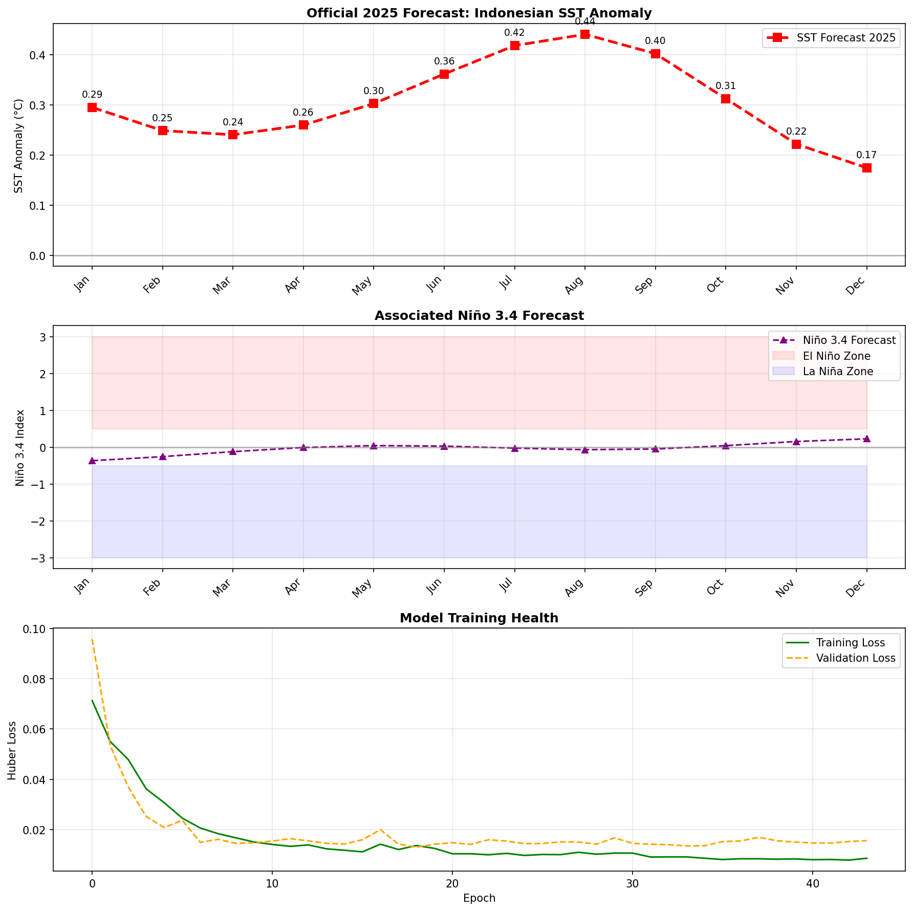

# Indonesian SST Prediction with LSTM


## Project Overview
Proyek ini memprediksi **Suhu Permukaan Laut (SST)** di perairan Indonesia menggunakan **Multivariate LSTM dengan Recursive Forecasting**. Model memanfaatkan **Niño 3.4 Index** sebagai prediktor dinamis untuk menangkap fenomena **El Niño-Southern Oscillation (ENSO)**.

---

## Project Structure

```
enso-forecasting/
├── data/
│   ├── raw/                    # Raw external data
│   │   └── nina34.anom.data.txt
│   └── processed/              # Processed data ready for modeling
│       └── sst_indo_clean.csv
├── data_sst/                   # Raw NetCDF files (gitignored)
├── output/
│   ├── figures/                # Generated plots
│   ├── models/                 # Saved model checkpoints
│   └── tables/                 # Forecast results (CSV)
├── download_data.py            # Download NetCDF from NOAA
├── preprocessing.py            # ETL: NetCDF → CSV
│
├── validation_2025_anomaly_sst.py    # Validation: SST Anomaly
├── validation_2025_absolute_sst.py   # Validation: Absolute SST (°C)
├── forecast_anomaly_sst.py           # Production: SST Anomaly 
└── forecast_absolute_sst.py          # Production: Absolute SST (°C)
```

---

## Scripts Overview

### Dua Mode Prediksi:

| Mode | Target | Contoh Output |
|------|--------|---------------|
| **Anomaly** | Penyimpangan dari rata-rata | +0.5°C, -0.3°C |
| **Absolute** | Suhu aktual | 29.5°C, 28.8°C |

### Script Pairs:

| Script | Purpose |
|--------|---------|
| `validation_2025_anomaly_sst.py` | Validasi prediksi anomaly vs ground truth 2025 |
| `validation_2025_absolute_sst.py` | Validasi prediksi absolute vs ground truth 2025 |
| `forecast_anomaly_sst.py` | Production: Blind forecast anomaly 2025 |
| `forecast_absolute_sst.py` | Production: Blind forecast absolute SST 2025 |

> **Validation** = Membandingkan prediksi dengan data aktual (mengukur akurasi)
> **Forecast** = Prediksi "buta" tanpa ground truth (simulasi dunia nyata)

---

## Data Sources
| Data | Source | Location |
|------|--------|----------|
| Indonesian SST | NOAA OISST V2 | `data/processed/sst_indo_clean.csv` |
| Niño 3.4 Index | NOAA ERSSTv5 | `data/raw/nina34.anom.data.txt` |

### Raw NetCDF Data (Not Included)
Folder `data_sst/` berisi file NetCDF mentah dari NOAA (~500MB per file) yang **tidak di-upload ke GitHub** karena ukurannya terlalu besar.

**Workflow:**
1. `download_data.py` → Download data NetCDF dari NOAA ke folder `data_sst/`
2. `preprocessing.py` → Olah data NetCDF menjadi `data/processed/sst_indo_clean.csv`

---

## Model Architecture

| Parameter | Value |
|-----------|-------|
| **Lookback Window** | 48 months (4 tahun konteks ENSO) |
| **Input Features** | 4 (SST, Niño, Sin Month, Cos Month) |
| **Output** | 2 (SST + Niño dinamis) |
| **Hidden Size** | 128 |
| **Layers** | 2 |
| **Loss Function** | Huber Loss |
| **LR Scheduler** | ReduceLROnPlateau |

### Key Features:
1. **Extended Lookback (48 bulan)** - Menangkap siklus ENSO penuh
2. **Cyclic Time Features (Sin/Cos)** - Menangkap pola musiman
3. **Multivariate Output** - Memprediksi SST + Niño secara bersamaan
4. **Recursive Forecasting** - Prediksi iteratif menggunakan output sebelumnya

---

## Results

### Production Forecast (Blind 2025)

#### SST Anomaly


#### Absolute SST


---

### Validation (vs Actual 2025 Data)

#### SST Anomaly Validation


#### Absolute SST Validation


---

## How to Run

```bash
# 1. Clone repository
git clone https://github.com/lainx86/enso-forecasting.git
cd enso-forecasting

# 2. Install dependencies
pip install -r requirements.txt

# 3. Download Data
python download_data.py

# 4. Run preprocessing
python preprocessing.py

# 5. Validation (bandingkan dengan ground truth 2025)
python validation_2025_anomaly_sst.py     # Anomaly mode
python validation_2025_absolute_sst.py    # Absolute mode

# 6. Production Forecast (blind prediction)
python forecast_anomaly_sst.py            # Anomaly mode
python forecast_absolute_sst.py           # Absolute mode
```

---

*Project ini dibuat sebagai eksplorasi Data Science di bidang Oseanografi.*
