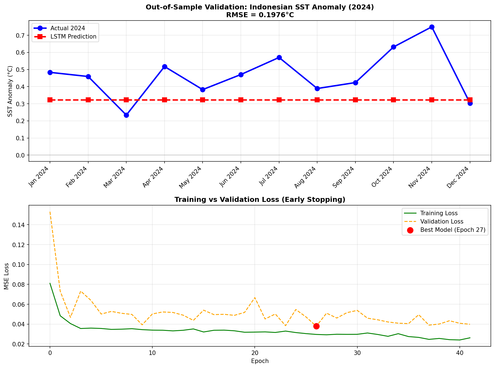
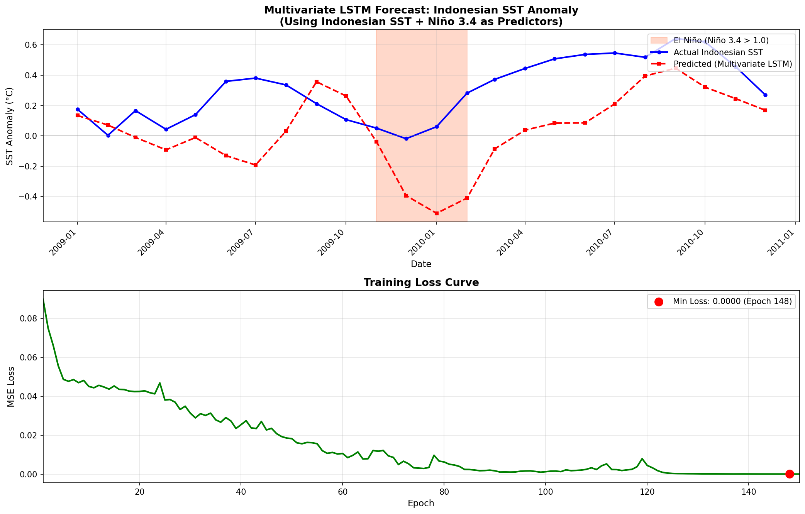
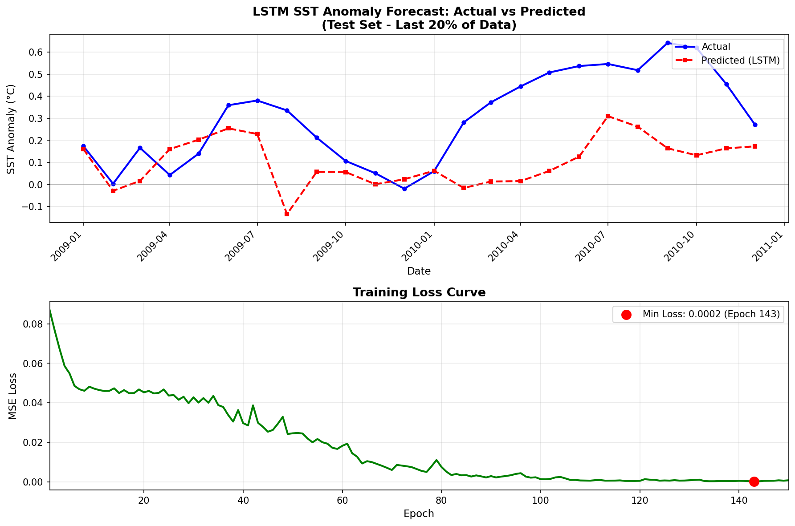

# Indonesian SST Anomaly Prediction with LSTM


## Project Overview
Proyek ini memprediksi **Anomali Suhu Permukaan Laut (SST)** di perairan Indonesia menggunakan **Multivariate LSTM**. Model memanfaatkan **Niño 3.4 Index** sebagai prediktor eksternal untuk menangkap fenomena **El Niño-Southern Oscillation (ENSO)**.

---

## Project Structure

```
enso-forecasting/
├── data/
│   ├── raw/                    # Raw external data
│   │   └── nina34.anom.data.txt
│   └── processed/              # Processed data ready for modeling
│       └── sst_indo_clean.csv
├── data_sst/                   # Raw NetCDF files (gitignored)
├── output/
│   └── figures/                # Generated plots and visualizations
│       ├── lstm_results.png
│       ├── multivariate_lstm_results.png
│       ├── validation_2024_results.png
│       └── sst_anomaly_trend.png
├── download_data.py            # Download NetCDF from NOAA
├── preprocessing.py            # ETL: NetCDF → CSV
├── modeling.py                 # Univariate LSTM
├── multivariate_modeling.py    # Multivariate LSTM (SST + Niño 3.4)
└── validation_2024.py          # Out-of-Sample Testing (Train: 2000-2023, Test: 2024)
```

---

## Data Sources
| Data | Source | Location |
|------|--------|----------|
| Indonesian SST | NOAA OISST V2 | `data/processed/sst_indo_clean.csv` |
| Niño 3.4 Index | NOAA ERSSTv5 | `data/raw/nina34.anom.data.txt` |

### Raw NetCDF Data (Not Included)
Folder `data_sst/` berisi file NetCDF mentah dari NOAA (~500MB per file) yang **tidak di-upload ke GitHub** karena ukurannya terlalu besar.

**Workflow:**
1. `download_data.py` → Download data NetCDF dari NOAA ke folder `data_sst/`
2. `preprocessing.py` → Olah data NetCDF menjadi `data/processed/sst_indo_clean.csv`

---

## Training Scripts Comparison

| Script | Input Features | Data Split | Use Case |
|--------|---------------|------------|----------|
| `modeling.py` | 1 (SST only) | 80/20 random | Baseline univariate model |
| `multivariate_modeling.py` | 2 (SST + Niño 3.4) | 80/20 random | Explore ENSO teleconnection |
| `validation_2024.py` | 2 (SST + Niño 3.4) | Temporal (2023/2024) | **Recommended** - True out-of-sample |

### Perbedaan Utama:
- **`modeling.py`**: Model hanya melihat sejarah SST Indonesia (univariate). Tidak memanfaatkan informasi ENSO dari Pasifik.
- **`multivariate_modeling.py`**: Menambahkan Niño 3.4 sebagai prediktor eksternal untuk menangkap telekoneksi ENSO. Split 80/20 random.
- **`validation_2024.py`**: Sama seperti multivariate, tapi dengan **temporal split** yang realistis. Model dilatih dengan data 2000-2023, lalu diuji pada 2024 yang tidak pernah dilihat saat training.

> **Rekomendasi**: Gunakan `validation_2024.py` untuk evaluasi paling valid karena mensimulasikan skenario forecasting nyata.

---

## Model Architecture

| Parameter | Value |
|-----------|-------|
| Type | Multivariate LSTM |
| Input Features | 2 (SST Indo + Niño 3.4) |
| Lookback Window | 12 months |
| Hidden Size | 32 |
| Output | 1 (Indonesian SST Anomaly) |

---

## Results

### Out-of-Sample Validation (Year 2024)


### Multivariate Prediction


### Univariate Prediction


---

## How to Run

```bash
# 1. Clone repository
git clone https://github.com/lainx86/enso-forecasting.git
cd enso-forecasting

# 2. Install dependencies
pip install -r requirements.txt
# 3. Download Data
python download_data.py

# 4. Run preprocessing (if starting fresh)
python preprocessing.py

# 5. Train & evaluate
python validation_2024.py          # Recommended: Out-of-sample validation
python multivariate_modeling.py    # Alternative: 80/20 split
```

---

*Project ini dibuat sebagai eksplorasi Data Science di bidang Oseanografi.*
